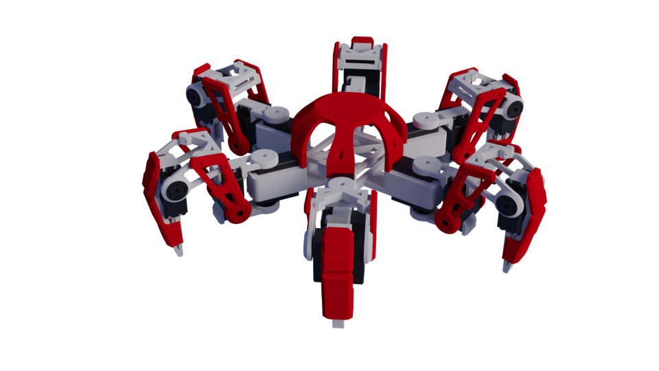

# Hexapod v2

This is a hexapod robot that was built based on the previous version [(Hexapod v1)](https://github.com/hexapod-project/hexapod-v1) but with simpler basic features, more efficient inverse kinematics algorithm, and better structured code. This is a base that will be used for more advanced features in the future.

## Hardwares
- Microcontroller: Esp32
- Servo controller: PCA9685 (2 boards, 3 legs (9 servos) per board)
- Servos: 18 x DSPower Servo - S020A (30KG servo) (Or any other servos that has the same dimension, mounting points and max. torque)
- Batteries: 1 x 6v 2400mAh Ni-MH (for powering the microcontroller), 1 x 7.4v 2600mAh Li-ion/Ni-Mh (for powering the servos)
- Esp32 Expansion Shield (Optional)
- A switch (Optional) - Eg. Rocker switch or toggle switch

## Libraries

- Arduino Esp32
- Adafruit_PWMServoDriver
- PlatformIO

## Circuit Diagram

## Assembly

- All parts can be found in the [stl](/stl) folder
- The parts can be 3D printed using PLA with 0.4 nozzle.

##### Body

- Use M3 x 20cm screws to attach the [TopCover.stl](/stl/TopCover.stl) to the [BaseBracket.stl](/stl/BaseBracket.stl)
- Use M3 screws to attach the ESP32 and PCA9685 Servo Drivers to the [BaseBracket.stl](/stl/BaseBracket.stl)

#### Servo

- Remove the bottom cover of the servo and replace it with the [DSPower30KGBracket.stl](/stl/DSPower30KGBracket.stl) and insert a M5 Book Binding Screw to the hole as a pivot for the joints.

#### Leg

- Assemble the leg parts according to the figure above.
- Use the screws provided by the servos to attach the parts to the servo.
- The legs are designed for the right legs but the parts can be flipped to be used for the left legs.

#### Body and Leg Attachment

- Remove the CoxaBottom part and attach the leg to the body using the screws provided by the servos.

#### Final Assembly

## Future Improvements

- Add Inertial Measurement Unit (IMU) for balancing
- Add LIDAR for obstacle detection
- Add GPS for position tracking
- Add path finding algorithm
- Migrate to Raspberry Pi for more processing power